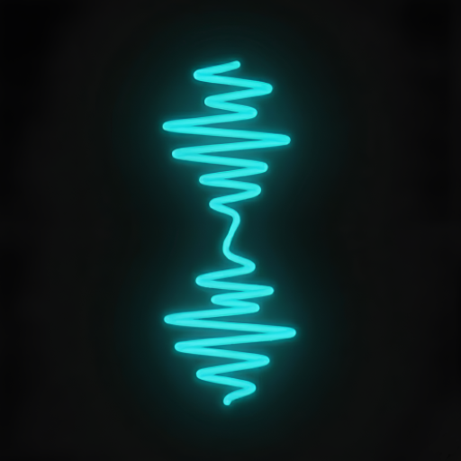
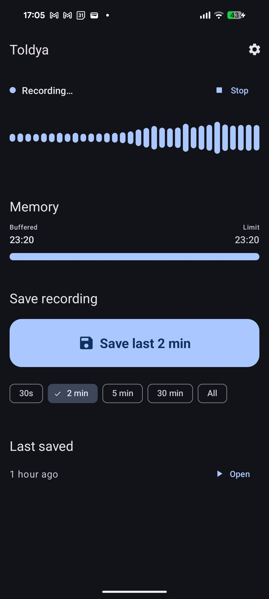
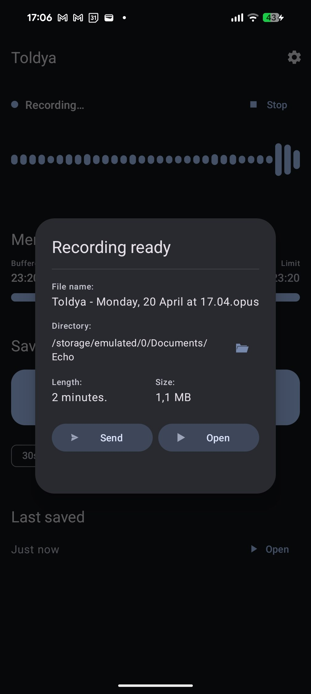
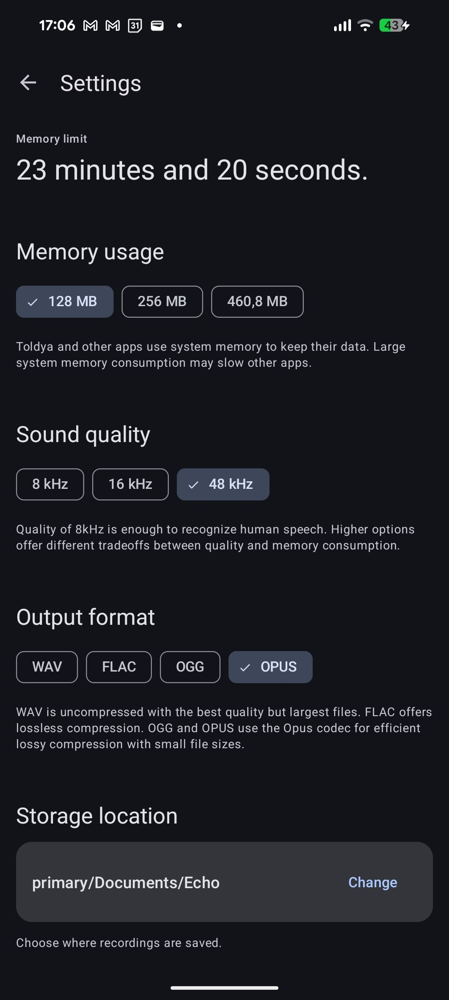

<div align="center">

# Toldya




**A time-travelling audio recorder for Android.**

Toldya continuously listens in the background and lets you save recordings of events that already happened.

> This is a fork of [mafik/echo](https://github.com/mafik/echo) with a redesigned UI and new features.

</div>

## Screenshots

<div align="center">
  
  &nbsp;&nbsp;
  
  &nbsp;&nbsp;
  
</div>

## Features

### New in this fork

- 🎨 **Material Design 3** — Complete UI overhaul with dynamic color, tonal surfaces, and modern MD3 components
- 📊 **Real-time waveform visualization** — Live microphone amplitude display on the main screen
- 🏠 **Redesigned main screen** — Flat sections with save CTA button and duration chip selector
- ⚙️ **Redesigned settings page** — Clean flat sections with filter chips, tappable time cards for schedule, and storage location picker
- 🎵 **Multiple output formats** — Save recordings as WAV, FLAC, OGG, or OPUS
- 📂 **Custom storage location** — Choose where recordings are saved via a directory picker
- ⏰ **Active hours schedule** — Automatically pause/resume recording during specified hours to save battery
- ▶️ **Last saved clip** — Quick access to the most recent recording with relative timestamp and play button
- 📝 **Auto-generated filenames** — Recordings are named with date and time by default, with the option to rename before saving
- 🔕 **Silent notifications** — Recording notification stays visible without sound or vibration
- ⏳ **Loading dialog** — Visual feedback while saving and compressing recordings

### From the original

- 🔴 **Continuous background recording** — Configurable memory buffer keeps audio in RAM
- 🎙️ **Adjustable audio quality** — 8kHz / 16kHz / 48kHz sample rates
- 💾 **Configurable RAM usage** — Control how much memory the audio buffer uses
- 🆓 **Free and open source** — Licensed under GPL-3.0

## Download

<a href="https://f-droid.org/repository/browse/?fdid=eu.mrogalski.saidit">
  
</a>

## Building

Clone the repository and open in Android Studio, or build from the command line:

```bash
git clone https://github.com/ArturLinnik/echo.git
cd echo
./gradlew assembleDebug
```

## License

This project is licensed under the [GNU General Public License v3.0](LICENSE.txt).

## Acknowledgments

- Forked from [mafik/echo](https://github.com/mafik/echo)
- Built with [Material Design 3](https://m3.material.io/)

---

<div align="center">

**Made with ❤️ by [Artur Linnik](https://github.com/ArturLinnik)**

</div>
